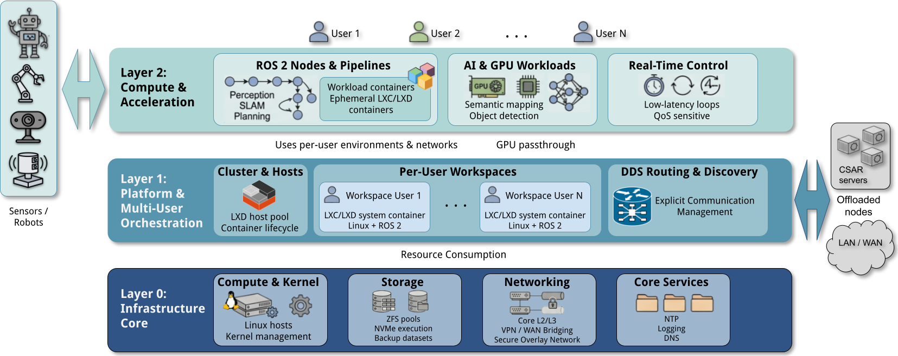

# CSAR — Containerized System Architecture for Robotics



This repository accompanies the paper:

> **CSAR: Containerized System Architecture for Robotics**  
> Gregorio Ambrosio-Cestero, Cipriano Galindo Andrades, Javier Gonzalez-Jimenez, Jose-Raul Ruiz-Sarmiento\
> [MAPIR Group](https://mapir.isa.uma.es/mapirwebsite/), University of Málaga\
> _[Link to paper / preprint — to be added upon publication]_

---

## What is CSAR?

CSAR is a **conceptual and architectural framework** for organizing shared infrastructure in robotics laboratories and the edge–cloud continuum. It is not a product or a platform — it is an operating model.

CSAR addresses persistent challenges in multi-user robotics teams: dependency isolation, reproducibility, efficient sharing of specialized hardware (especially GPUs), and deployment across heterogeneous environments. It combines:

- **LXC/LXD system containers** as persistent, hardware-affine execution environments
- **ROS 2 / DDS** for distributed robotic communication
- A **three-layer edge infrastructure** that separates stable substrate concerns from volatile experimental workloads

The framework is structured into three functional layers:

| Layer | Name | Role |
|-------|------|------|
| Layer 0 | Infrastructure Core | Kernel, storage, networking, long-lived services |
| Layer 1 | Platform & Multi-User Orchestration | LXC/LXD lifecycle, isolation, portability |
| Layer 2 | Compute & Acceleration | ROS 2 nodes, GPU workloads, experimental pipelines |

---

## Repository Contents

```
mapir-csar/
├── README.md                        # This file
├── CITATION.cff                     # Machine-readable citation
├── LICENSE                          # Apache 2.0
│
├── docs/
│   ├── architecture.md              # CSAR layer descriptions and design rationale
│   ├── design-principles.md         # Core conceptual principles
│   ├── glossary.md                  # CSAR-specific terminology
│   ├── networking.md                # Networking model: DNS, overlay, DDS routing
│   ├── user-guide.md                # End-user guide (containers, images, SSH access)
│   └── administration-guide.md      # Admin guide (account creation, monitoring)
│
├── deployment/
│   ├── README.md                    # How to read and adapt these templates
│   ├── lxd/
│   │   ├── profiles/                # LXD profile YAML templates
│   │   └── cloud-init/              # cloud-init stubs for container bootstrap
│   ├── networking/
│   │   ├── overlay/                 # Secure overlay (ZeroTier) config templates
│   │   └── dds/                     # DDS Router + Discovery Server config
│   └── monitoring/
│       ├── prometheus/              # Prometheus config for LXD metrics
│       ├── loki/                    # Loki log aggregation setup
│       └── grafana/                 # Grafana installation notes
│
├── use-cases/
│   ├── README.md                    # Overview of both use cases
│   ├── uc1-slam-5g/                 # Edge-offloaded 3D SLAM over 5G
│   │   └── README.md
│   └── uc2-semantic-mapping/        # GPU-accelerated distributed semantic mapping
│       └── README.md
│
└── paper/
    └── README.md                    # Paper reference, abstract, authors
```

---

## Reference Deployment

The framework has been deployed in the **MAPIR laboratory** (Machine Perception and Intelligent Robotics group) at the University of Málaga. The deployment described in the paper uses:

- A high-performance server (`uedge`) with AMD Threadripper PRO, 512 GB RAM, 3× NVIDIA RTX 6000 Ada
- An edge server (`edge`) with Intel Core i7, 128 GB RAM, NVIDIA RTX 3060 Ti + Titan X
- A MikroTik hAP ax3 router for physical and overlay network management

All hostnames, IPs, and credentials in this repository are **placeholders**. Replace them with your own values before deployment.

---

## Getting Started

If you want to adopt CSAR in your own robotics laboratory:

1. Read [`docs/architecture.md`](docs/architecture.md) to understand the framework
2. Read [`docs/design-principles.md`](docs/design-principles.md) for the conceptual rationale
3. Follow [`deployment/README.md`](deployment/README.md) to set up the infrastructure
4. See [`use-cases/`](use-cases/) for concrete deployment examples

---

## License

This repository is licensed under the [Apache License 2.0](LICENSE).

---

## Contact

MAPIR Group — University of Málaga  
<https://mapir.isa.uma.es>  
Corresponding author: Gregorio Ambrosio-Cestero — `gambrosio@uma.es`
