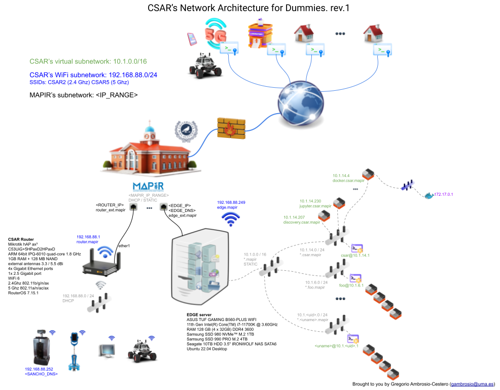
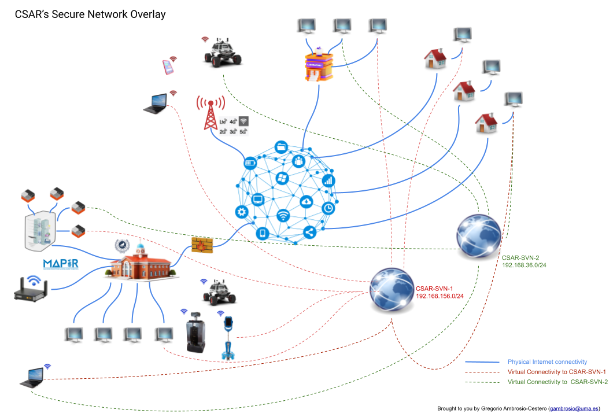

# CSAR Reference Guide

**Containerized System Architecture for Robotics**

Gregorio Ambrosio Cestero (`gambrosio@uma.es`) — Rev. 0/05/2026

---

## Table of Contents

1. [Introduction](#1-introduction)
   - 1.1 [Definition](#11-definition)
   - 1.2 [Containers](#12-containers)
   - 1.3 [Objectives](#13-objectives)
2. [Implementation](#2-implementation)
   - 2.1 [Physical Resources](#21-physical-resources)
   - 2.2 [Key Features for Users](#22-key-features-for-users)
3. [User Account](#3-user-account)
   - 3.1 [The CSAR Account](#31-the-csar-account)
   - 3.2 [Access from Ubuntu 22.04/24.04](#32-access-from-ubuntu-220424040)
   - 3.3 [Access from Windows 10/11](#33-access-from-windows-1011)
4. [Containers](#4-containers)
   - 4.1 [The `lxc` and `csar` Commands](#41-the-lxc-and-csar-commands)
   - 4.2 [Images](#42-images)
   - 4.3 [Creating Basic Containers](#43-creating-basic-containers)
   - 4.4 [Creating Containers from CSAR Images](#44-creating-containers-from-csar-images)
   - 4.5 [Accessing a Container](#45-accessing-a-container)
   - 4.6 [Updating a Container](#46-updating-a-container)
   - 4.7 [Snapshots](#47-snapshots)
   - 4.8 [Copying Containers to Other Users](#48-copying-containers-to-other-users)
   - 4.9 [Creating and Distributing Images](#49-creating-and-distributing-images)
   - 4.10 [Copying Files Between Your Machine and a Container](#410-copying-files-between-your-machine-and-a-container)
   - 4.11 [Graphical Environment](#411-graphical-environment)
5. [Storage](#5-storage)
   - 5.1 [Storage on edge](#51-storage-on-edge)
   - 5.2 [Storage on uedge](#52-storage-on-uedge)
6. [Shared Datasets and Resources](#6-shared-datasets-and-resources)
7. [Monitoring](#7-monitoring)
8. [Networking](#8-networking)
   - 8.1 [Overview](#81-overview)
   - 8.2 [Communication Capabilities](#82-communication-capabilities)
   - 8.3 [Physical Device Names and Addresses](#83-physical-device-names-and-addresses)
   - 8.4 [WiFi Network](#84-wifi-network)
   - 8.5 [Container Names and IP Addresses](#85-container-names-and-ip-addresses)
   - 8.6 [DNS Resolution](#86-dns-resolution)
   - 8.7 [Secure Network Overlay](#87-secure-network-overlay)
9. [Common Services](#9-common-services)
   - 9.1 [MQTT Broker](#91-mqtt-broker)
   - 9.2 [Hybrid LXC/Docker Containers](#92-hybrid-lxcdocker-containers)
   - 9.3 [ROS 2 in CSAR](#93-ros-2-in-csar)

---

## 1. Introduction

### 1.1 Definition

CSAR is a micro-cloud service for robotics research groups that, under the Edge Computing paradigm, provides the computational resources needed for robotic software development in a mixed environment composed of physical and virtual devices.

In practice, CSAR is a distributed Linux-based system that currently consists primarily of a communications device and two appropriately sized, interconnected servers. It allows its users to have an account under which they can create and manage their own containers for developing their particular robotic software solutions. Those solutions can be made available to other users, since containers connect to the network like any other device and can communicate with each other and with the rest of the physical devices connected to the network.

### 1.2 Containers

We begin by recalling what a **virtual machine** (VM) is: a virtual version of a physical machine that uses the hardware features of the machine that contains it, i.e., its host. Virtual machines are software components that simulate complete computers inside a real physical computer. The physical computer's resources are shared among the different virtual machines. The software that enables the creation of VMs is called a hypervisor, and it manages the VMs and distributes the physical resources of the host machine. There are many well-known hypervisors: VMware, VirtualBox, Microsoft Hyper-V, Citrix, KVM, QEMU, etc. Because VMs have their own virtualized kernel and hardware, they can run any common operating system such as Windows or Linux. Consequently, VMs consume more resources and run more slowly than their physical counterparts, although they are very flexible.

A **container**, by contrast, is a software component that allows applications or complete systems to run in isolation, sharing the kernel of the physical host operating system while having their own execution space (libraries, processes, network, etc.). We could say that a container is based on a lightweight virtualization technology that allows a set of processes to run in an isolated manner within a single operating system, using kernel mechanisms such as namespaces for isolation and cgroups for resource control.

In the world of containers, we usually find two types: application containers and system containers.

**Application containers** are the best known, primarily through Docker or Podman. They contain a single application or process along with the minimal set of software components needed for it to run. These applications or processes execute in isolation within a single operating system, sharing the same host OS kernel but with their own execution space (processes, libraries, network, etc.).

**System containers**, on the other hand, encapsulate complete operating systems that share the host OS kernel and therefore access physical resources directly. System containers are Linux-only, since they rely on Linux kernel features such as namespaces and cgroups.

CSAR supports both application containers — via Docker and Podman — and system containers via LXC/LXD, which also supports virtual machines. Application containers in CSAR allow running many solutions that are already available online. However, **the primary technology in CSAR is that of system containers, as it is the most suitable for the development of distributed robotic software**, generally based on ROS.

Although common in container systems, CSAR does not currently include orchestration technology, though this may change in the future.

### 1.3 Objectives

- Provide access to costly physical resources (e.g., GPUs) and make them accessible from multiple containers, in which users have complete freedom to install software and apply different configurations.
- Allow each container to be configured with specific versions of different software packages to meet particular needs. Special attention is given to the development of [ROS](https://ros.org/) nodes. Each user can have as many containers as needed, each configured independently without interfering with others.
- Containers are connected to a hybrid (virtual and physical) local network accessible both inside and outside the laboratory, including from outside the university network.
- Users have **superuser (sudo) privileges** within their containers, so they can configure them freely by installing any type of software for their research. ROS nodes or other services developed within containers become accessible on the network to other users or physical devices.
- CSAR provides resources to its users quickly and efficiently in the form of containers with access to specialized hardware that might otherwise be difficult to obtain.
- Users can access CSAR from their personal computers running either Linux or Windows, without disrupting their own installations or personal configurations.
- CSAR enables remote work: the servers are accessible on the internet, so users can connect to them comfortably via SSH from machines outside the laboratory.

---

## 2. Implementation

CSAR is currently based on two servers — `edge` and `uedge`, whose names reflect their role in the Edge Computing architecture — and a MikroTik router for communication services.

### 2.1 Physical Resources

**uedge** is a high-performance server connected to the institutional network. Its specifications are:

- Motherboard: ASUS Pro WS WRX90E-SAGE SE
- CPU: AMD Ryzen Threadripper PRO 7975WX (32 cores) at 4.0 GHz
- RAM: 512 GB DDR5 ECC 4800 MHz
- Network: 2 × 10 GbE Ethernet
- Storage: 2 TB NVMe M.2 + 4 TB NVMe M.2 + 18 TB SATA 6 Gbps
- GPU: 3 × NVIDIA RTX 6000 Ada 48 GB GDDR6
- OS: Ubuntu 22.04, NVIDIA driver 560.35.03, CUDA 12.6

**edge** is a laboratory-facing edge server. Its specifications are:

- Motherboard: ASUS TUF GAMING B560-PLUS WIFI
- CPU: Intel Core i7-11700K (8 cores) at 3.6 GHz
- RAM: 128 GB DDR4 3600 MHz
- Network: 2.5 GbE Ethernet
- Storage: 1 TB NVMe M.2 + 4 TB NVMe M.2 + 10 TB SATA 6 Gbps
- GPU: NVIDIA GeForce RTX 3060 Ti (Ampere, 8 GB GDDR6) + NVIDIA TITAN X (Pascal, 12 GB GDDR5)
- OS: Ubuntu 22.04, NVIDIA driver 535.183.01, CUDA 12.2

**magician** is a MikroTik hAP ax3 router ([C53UiG+5HPaxD2HPaxD](https://mikrotik.com/product/hap_ax3)) that interconnects WiFi, physical, and virtual networks. Its specifications are:

- CPU: ARM 64-bit IPQ-6010 (4 cores) at 1.8 GHz
- RAM: 1 GB + 128 MB NAND
- Network: 4 × Gigabit Ethernet + 1 × 2.5 Gigabit Ethernet
- WiFi: WiFi 6 (802.11ax), dual band (2.4 GHz + 5 GHz)

### 2.2 Key Features for Users

- CSAR users have an account with normal Unix user profile (no host-level superuser privileges), but with full LXD permissions to create, delete, and manage their own **containers**, in which they **do have superuser (sudo) privileges**.
- Each user has a subnet with a dedicated IP address range, automatically or manually assigned to containers. The range per server is a subnetted class A network providing 254 IP addresses. The range is `10.1.<uid>.0/24` on `edge` and `10.2.<uid>.0/24` on `uedge`.
- Each user has their own DNS domain: `<username>.edge.mapir` on `edge` and `<username>.uedge.mapir` on `uedge`. For example, if user `foo` on `edge` (with UID 1003) has a container named `mycontainer`, it is identified on the network as `mycontainer.foo.edge.mapir` and has an address such as `10.1.3.36`, where the last byte is assigned automatically by CSAR.
- Users have access to CSAR-specific images to generate containers. These images allow containers to be created in seconds, incorporating complete operating systems with their drivers, utilities, and development environments.

---

## 3. User Account

### 3.1 The CSAR Account

A CSAR account must be requested through your laboratory's CSAR administrator.

Depending on the available resources and the objectives of the work to be performed, the account will be created on `uedge` or on `edge`. We will usually refer to the account as `<user@uedge>` (meaning "my username on server uedge") or `<user@edge>`.

The CSAR account has a normal Unix user profile (no host-level superuser privileges). On `edge`, CSAR user accounts have access to Docker, Podman, and LXC/LXD. On `uedge`, only LXC/LXD is currently available.

The CSAR account resides on the server, so a workstation is needed to connect to it. Users do not work directly on the servers; they use a Linux or Windows machine to connect. That local machine can be any device connected to the MAPIR laboratory network, or even one outside the university network — for example, a laptop at home can access a CSAR server.

### 3.2 Access from Ubuntu 22.04/24.04

Accessing CSAR means connecting to the server assigned to your account (`edge` or `uedge`) via the [SSH](https://en.wikipedia.org/wiki/Secure_Shell) protocol using key-based authentication (avoiding passwords).

#### Creating the `~/.ssh/config` file

From your workstation's home directory (`/home/$USER`), open a terminal and create (or append to) the file `~/.ssh/config` with the following content:

**For uedge:**

```
Host uedge
    HostName <YOUR_UEDGE_IP>
    Port 22
    User <user@uedge>         # your username on uedge (without @uedge)
    ForwardX11 yes
    Compression yes
    ServerAliveInterval 600
    ServerAliveCountMax 6
```

**For edge:**

```
Host edge
    HostName <YOUR_EDGE_IP>
    Port 22
    User <user@edge>          # your username on edge (without @edge)
    ForwardX11 yes
    Compression yes
    ServerAliveInterval 600
    ServerAliveCountMax 6
```

#### Downloading the private key to your workstation

Each CSAR user has a pre-defined key pair in their server home directory (`~/.ssh`): `roslab` (private) and `roslab.pub` (public).

Copy the private key to your workstation:

```bash
scp <username>@<YOUR_EDGE_IP>:~/.ssh/roslab ~/.ssh/      # edge
scp <username>@<YOUR_UEDGE_IP>:~/.ssh/roslab ~/.ssh/     # uedge
```

Or, if you have already created the `~/.ssh/config` file:

```bash
scp edge:~/.ssh/roslab ~/.ssh/     # edge
scp uedge:~/.ssh/roslab ~/.ssh/    # uedge
```

#### Adding the SSH agent to `~/.bashrc`

Add the following to your workstation's `~/.bashrc` so the SSH agent starts automatically at login:

```bash
# ssh-agent
eval "$(ssh-agent -s)"
ssh-add ~/.ssh/roslab
```

If you do not want to log out and back in, run `source ~/.bashrc` once.

#### Connecting to the server

```bash
ssh edge    # or
ssh uedge
```

### 3.3 Access from Windows 10/11

Open PowerShell as administrator (`Windows key + X`).

By default, the SSH agent service is disabled. Enable it once:

```powershell
Get-Service ssh-agent | Set-Service -StartupType Automatic
Start-Service ssh-agent
```

Create the `.ssh` directory and copy the private key there (use [WinSCP](https://winscp.net/) or equivalent), then add the key:

```powershell
ssh-add $env:USERPROFILE\.ssh\roslab
```

Create the file `C:\Users\<your_windows_user>\.ssh\config` with the same content as the Linux example above (replacing `<YOUR_EDGE_IP>`, `<YOUR_UEDGE_IP>`, and usernames accordingly).

To connect in text mode:

```bash
ssh edge    # or
ssh uedge
```

---

## 4. Containers

CSAR facilitates the development of distributed robotic software primarily through system containers based on LXC/LXD. Day-to-day interaction with CSAR happens from a terminal using the `lxc` and `csar` commands.

### 4.1 The `lxc` and `csar` Commands

The main commands are:

```bash
lxc launch     # create a container from an image
lxc list       # list your containers and their state
lxc stop       # shut down a container
lxc pause      # suspend a container
lxc start      # boot a container
lxc restart    # reboot a container
lxc delete     # delete a container (no confirmation prompt!)
lxc copy       # copy a container
lxc move       # move a container between pools, users, or servers
lxc exec       # run a command inside a container
```

For more complex operations or those requiring elevated permissions:

```bash
csar free          # show available space in each storage pool
csar containers    # show disk usage per container
csar launch        # create a container from a CSAR image
csar restart-dns   # restart the user's virtual DNS service
```

Use `lxc --help` and `csar --help` for a full list of options.

### 4.2 Images

An image is a binary file that resides on an image server and acts as a template for creating containers or virtual machines. Canonical, the company that develops Ubuntu and has adopted LXC/LXD, provides images for most existing Linux distributions. These allow the creation of basic containers with clean operating systems. However, CSAR provides its own pre-built images that produce fully configured containers, saving significant time and effort.

### 4.3 Creating Basic Containers

> **Note:** The procedure in this section is not the recommended approach. **The most appropriate method is to use CSAR images as described in section 4.4.** This section documents container creation for cases whose requirements are not covered by existing images.

Creating containers without CSAR images requires knowledge of LXC/LXD beyond the scope of this guide. The most common procedure to create a minimal test container is:

```bash
lxc launch ubuntu:22.04 <container_name> -t aws:t2.micro
```

#### Key configuration for basic containers

CSAR containers use SSH for secure access. For basic containers, you must configure SSH keys manually. Each CSAR user has a pre-defined key pair in `~/.ssh`: `roslab` (private) and `roslab.pub` (public). An SSH agent is started automatically at login (see `~/.bashrc`).

Copy the public key from your account on the server to the container:

```bash
# Copy the public key to the container
lxc file push ~/.ssh/roslab.pub <container>/home/ubuntu/.ssh/

# Enter the container as root (CSAR alias)
lxc ubuntu <container>
```

Inside the container (logged in as `ubuntu`):

```bash
cd .ssh
sudo chown ubuntu roslab.pub
sudo chgrp ubuntu roslab.pub
cat roslab.pub >> authorized_keys
exit
```

Back on the server, you can now connect to the container without a password:

```bash
ssh -X ubuntu@<container>.<user@edge>.edge.mapir     # edge
ssh -X ubuntu@<container>.<user@uedge>.uedge.mapir   # uedge
```

### 4.4 Creating Containers from CSAR Images

#### The image server

CSAR provides an **image server** that contains the most common and useful images. These images produce fully configured containers (with keys, software, drivers, utilities, etc.) for a specific purpose.

The CSAR image server is already added to your account, which you can verify with:

```bash
lxc remote list
```

Running this from `uedge` produces output similar to:

```
+----------------------+---------------------------------------------------+---------------+
|         NAME         |                        URL                        |   PROTOCOL    |
+----------------------+---------------------------------------------------+---------------+
| edge                 | https://<YOUR_EDGE_IP>:8443                       | lxd           |
| images               | https://images.lxd.canonical.com                  | simplestreams |
| local (current)      | unix://                                           | lxd           |
| ubuntu               | https://cloud-images.ubuntu.com/releases/         | simplestreams |
| ubuntu-daily         | https://cloud-images.ubuntu.com/daily/            | simplestreams |
| uedge                | https://127.0.0.1:8443                            | lxd           |
+----------------------+---------------------------------------------------+---------------+
```

#### Listing images

```bash
lxc image list uedge:
```

#### Reference images

The current recommended images are:

| Name | OS | Description |
|------|-----|-------------|
| `tuxlab-jazzy:1.1` | Ubuntu 22.04 LTS | Base development image (NVIDIA drivers, XFCE, utilities) |
| `tuxlab-jazzy-cuda:1.2` | Ubuntu 22.04 LTS | Base image + CUDA 12.2, cuDNN 8.9.6, PyTorch, OpenCV (GPU build) |
| `tuxlab-jazzy-ros2-humble:2.1` | Ubuntu 22.04 LTS | Base image + ROS 2 Humble full desktop |
| `tuxlab-jazzy-ros2-humble-cuda:2.1` | Ubuntu 22.04 LTS | Base image + ROS 2 Humble + CUDA |
| `discovery-jazzy-ros2-humble:1.1` | Ubuntu 22.04 LTS | ROS 2 Discovery Server configured as a system service |
| `dockerlab-jazzy:1.1` | Ubuntu 22.04 LTS | Hybrid LXC/Docker container with GPU access and Portainer |
| `mosquitto-jazzy:1.0` | Ubuntu 22.04 LTS | Mosquitto-based MQTT broker |
| `tuxlab-noble:2.0` | Ubuntu 24.04 LTS | Base development image (Ubuntu 24.04) |
| `tuxlab-noble-vulcanexus-jazzy-desktop:2.0` | Ubuntu 24.04 LTS | Base image + Vulcanexus Jazzy Jolo (eProsima ROS 2 distribution) |

Image descriptions:

- **`tuxlab-jazzy:1.1`** — Development workstation image based on Ubuntu 22.04 with NVIDIA drivers, C++, Python, XFCE graphical environment, `shares` and `uploads` folders pre-mounted, SSH key access, and many utilities.
- **`tuxlab-jazzy-cuda:1.2`** — Extends `tuxlab-jazzy:1.1` with CUDA 12.2, cuDNN 8.9.6, PyTorch, Pillow, and OpenCV compiled with GPU support.
- **`tuxlab-jazzy-ros2-humble:2.1`** — Extends `tuxlab-jazzy:1.1` with ROS 2 Humble full desktop.
- **`tuxlab-jazzy-ros2-humble-cuda:2.1`** — Extends `tuxlab-jazzy-cuda:1.2` with ROS 2 Humble full desktop.
- **`discovery-jazzy-ros2-humble:1.1`** — A ROS 2 Discovery Server configured as a systemd service, remaining active across reboots.
- **`dockerlab-jazzy:1.1`** — Hybrid LXC/Docker image. Creates an LXC container that runs Docker, with Portainer, GPU access, and CSAR network integration.
- **`mosquitto-jazzy:1.0`** — MQTT broker based on Mosquitto.
- **`tuxlab-noble:2.0`** — Similar to `tuxlab-jazzy` but based on Ubuntu 24.04.
- **`tuxlab-noble-vulcanexus-jazzy-desktop:2.0`** — Extends `tuxlab-noble` with the eProsima Vulcanexus Jazzy Jolo ROS 2 distribution.

#### Creating containers with the `csar` command

```bash
csar launch <server>:<image_name> <container_name>
```

For example:

```bash
csar launch uedge:tuxlab-jazzy-ros2-humble:2.1 c1
```

The command completes in a few seconds (CUDA images take slightly longer) and produces a fully configured running container.

Verify with:

```bash
lxc ls
+------+---------+-------------------+------+-----------+-----------+
| NAME | STATE   | IPV4              | IPV6 | TYPE      | SNAPSHOTS |
+------+---------+-------------------+------+-----------+-----------+
| c1   | RUNNING | 10.2.nnn.95 (eth0)|      | CONTAINER | 0         |
+------+---------+-------------------+------+-----------+-----------+
```

### 4.5 Accessing a Container

CSAR containers have a pre-configured user (`ubuntu`) for access.

#### From a CSAR account on edge

```bash
ssh -X ubuntu@<container>.<user@edge>.edge.mapir
```

#### From a CSAR account on uedge

```bash
ssh -X ubuntu@<container>.<user@uedge>.uedge.mapir
```

#### Directly from your workstation

Add the following to `~/.ssh/config`:

**For a container on edge:**

```
Host <container>
    HostName <container>.<user@edge>.edge.mapir
    Port 22
    User ubuntu
    ForwardX11 yes
    Compression yes
    ProxyJump edge
    ServerAliveInterval 600
    ServerAliveCountMax 6
```

**For a container on uedge:**

```
Host <container>
    HostName <container>.<user@uedge>.uedge.mapir
    Port 22
    User ubuntu
    ForwardX11 yes
    Compression yes
    ProxyJump uedge
    ServerAliveInterval 600
    ServerAliveCountMax 6
```

Then from your workstation:

```bash
ssh <container>
```

### 4.6 Updating a Container

CSAR images are built at a specific point in time. **Containers created from them should always be updated immediately:**

```bash
sudo apt update && sudo apt upgrade -y
```

### 4.7 Snapshots

Containers support snapshots — a point-in-time capture of the container state that allows you to revert to that state later.

A common use case is to take a snapshot just before making potentially disruptive changes (installing software, drivers, etc.), so that you can restore the original state if something goes wrong.

```bash
# Create a snapshot
lxc snapshot <container_name> <snapshot_name>

# Restore a snapshot
lxc restore <container_name> <snapshot_name>

# List snapshots
lxc info <container_name>

# Delete a snapshot
lxc delete <container_name>/<snapshot_name>
```

Multiple snapshots can be created and restored in LIFO (last in, first out) order.

### 4.8 Copying Containers to Other Users

Any CSAR user can copy their containers to other users. First, determine the destination user's LXD project name. Each user can find their own project name with:

```bash
lxc project list
# or
echo user-$(id -u)
```

**Permission from the CSAR administrator is required before copying to another user.** Once permission is confirmed:

```bash
lxc cp <my_container> <server>:<copy_name> \
    --target-project <destination_user_project>
```

For example, if user `foo` wants to copy `foo-container` to user `bar` (project `user-1004`) as `copy-of-foo-container`:

```bash
lxc cp foo-container uedge:copy-of-foo-container --target-project user-1004
```

### 4.9 Creating and Distributing Images

CSAR users can create their own images from their containers and share them with others.

#### Creating an image

```bash
lxc publish <container_name> --alias <image_name> --public --force
# --public makes the image visible to others
# --force stops the container before publishing
```

Verify the image was created:

```bash
lxc image list
```

Delete an image:

```bash
lxc image delete <image_name>
```

#### Sharing an image with a specific user

**Permission from the CSAR administrator is required.** Once granted:

```bash
lxc image copy <image_name> <server>: \
    --target-project <destination_user_project> \
    --alias <new_image_name>
```

#### Publishing an image to all users

Use `--target-project default` to make the image available to all users:

```bash
lxc image copy <image_name> uedge: \
    --target-project default \
    --alias <new_image_name>
```

All CSAR users can then create containers from the image:

```bash
csar launch uedge:<new_image_name> <container_name>
```

#### Complete example

User `foo` creates image `foo-image` from `foo-container` and shares it with user `bar` (project `user-1004`):

```bash
lxc publish foo-container --alias foo-image --public --force
lxc image copy foo-image uedge: --target-project user-1004 --alias foo-image
```

User `bar` can then use the image:

```bash
csar launch foo-image bar-container
```

### 4.10 Copying Files Between Your Machine and a Container

#### Via command line

Use `scp` with the `-J` option to proxy through the server:

```bash
# Copy a local folder to a container
scp -r -J <username>@<YOUR_UEDGE_IP> test ubuntu@c1.<username>.uedge.mapir:test

# Copy from a container to local
scp -r -J <username>@<YOUR_UEDGE_IP> ubuntu@c1.<username>.uedge.mapir:test .
```

The `-r` flag copies directories recursively. The `-J` flag specifies the proxy host.

#### Via Nautilus (Linux file manager)

Add a container entry to `~/.ssh/config` as shown in section 4.5. Then in Nautilus, open a location (e.g., `Ctrl+L`) and enter:

```
sftp://c1/home/ubuntu
```

### 4.11 Graphical Environment

All CSAR servers and containers created from CSAR images include an XFCE graphical desktop.

**From Linux:** Any graphical application launched from an SSH session with `ForwardX11 yes` opens directly on your local display. No additional setup is needed. You can test with:

```bash
xeyes
```

**Full desktop access from Ubuntu** — install Remmina:

```bash
sudo apt install remmina
```

Create an RDP connection to `<YOUR_SERVER_IP>` or the container's FQDN.

**From Windows:** After establishing an SSH connection (see section 3.3), open Remote Desktop to `localhost:3388`.

---

## 5. Storage

### 5.1 Storage on edge

`edge` currently has four storage pools: `pool1`, `pool2`, `pool3`, and `pool4`.

| Pool | Device | Size | Purpose |
|------|--------|------|---------|
| `pool1` | Samsung SSD 980 (partition) | ~300 GB | System (active, usable) |
| `pool2` | Samsung SSD 980 (partition) | ~300 GB | System (active, usable) |
| `pool3` | Samsung SSD 990 PRO | 4 TB | **Default** — active containers |
| `pool4` | Seagate IronWolf SATA3 | 10 TB | Backup, low-use containers |

```bash
csar free             # check available space per pool
csar containers       # check disk usage per container

# Create a container in a specific pool
lxc launch <image> <container> -s pool<n>

# Move a container to another pool (stop first)
lxc stop <container>
lxc move <container> -s pool<n>
```

#### Default storage

`pool3` is the default. The `csar launch` and `lxc launch` commands use it automatically — no action required.

#### Backup storage

Use `pool4` for backups or infrequently used containers:

```bash
lxc stop c1
lxc cp c1 c1-bak -s pool4              # backup copy
lxc cp c1 c1-20240427-bak -s pool4     # timestamped backup

lxc stop c2
lxc mv c2 -s pool4                     # move (low-use container)
```

Containers on `pool4` are fully operational — they just run at lower I/O throughput due to the SATA3 disk. Move them back to `pool3` at any time:

```bash
lxc mv <container> -s pool3
```

### 5.2 Storage on uedge

`uedge` has two storage pools: `pool1` and `pool2`.

| Pool | Device | Size | Purpose |
|------|--------|------|---------|
| `pool1` | WD_BLACK SN850X NVMe | 4 TB | **Default** — active containers |
| `pool2` | Seagate IronWolf SATA3 | 18 TB | Backup, low-use containers |

The OS is installed on a separate WD_BLACK SN850X 2 TB drive not accessible from the container system.

The same commands apply as for `edge`, replacing pool numbers accordingly:

```bash
csar free
csar containers
lxc launch <image> <container> -s pool<n>
lxc stop <container>
lxc move <container> -s pool<n>
```

---

## 6. Shared Datasets and Resources

In robotics, datasets — collections of experimental data for reuse — are common and typically large. To avoid duplicating storage, CSAR provides a shared resource area that makes datasets and other useful materials available to all users.

This shared area can be accessed from the user account on the server or from any container.

#### Access from the user account

On `uedge`, users have access to the following directory structure directly (without entering any container):

```
/mnt/
└── shares/
    └── datasets/
        ├── <dataset-1>/
        ├── <dataset-2>/
        └── ...
```

#### Access from a container

Containers created from current `tuxlab` images already have `~/shares` and `~/uploads` mounted at login. **The instructions below apply only to containers created from older CSAR image versions.**

Copy the private key to the container to avoid password prompts:

```bash
scp .ssh/roslab ubuntu@<container>.<username>.uedge.mapir:~/.ssh
```

Inside the container:

```bash
sudo apt install sshfs
```

Edit `/etc/fuse.conf` and uncomment the line:

```
# user_allow_other
```

so it reads:

```
user_allow_other
```

Add the following to `~/.bashrc` inside the container:

```bash
# SSH agent
eval "$(ssh-agent -s)"
ssh-add ~/.ssh/roslab

# Mount shared folder
mkdir -p ~/shares
sshfs ubuntu@shares.csar.uedge.mapir:/mnt/shares ~/shares
```

Then run `source ~/.bashrc` or log out and back into the container.

#### Recovering a stale mount

If the connection was lost irregularly, you may see errors like:

```
fuse: failed to access mountpoint /home/ubuntu/shares: Transport endpoint is not connected
```

Fix:

```bash
fusermount -u ~/shares
fusermount -u ~/uploads
# optionally: rm -r shares uploads
```

Then log back in or run `source ~/.bashrc`.

The `uploads` directory has write permissions, allowing users to upload datasets of potential interest to others. The administrator will move uploads to `shares` upon request.

---

## 7. Monitoring

CSAR servers include a monitoring system for checking system health and analyzing the impact of running containers.

#### Monitoring edge

The monitoring service runs in a container and is accessible via a browser.

**From the graphical interface on the server** (connected via Remmina or Remote Desktop):

```
http://metrics.<your-username>.edge.mapir:3000
```

**From a remote workstation** — add to `~/.ssh/config`:

```
Host metrics.<your-username>.edge.mapir
    HostName metrics.<your-username>.edge.mapir
    Port 22
    User ubuntu
    ForwardX11 yes
    Compression yes
    ProxyJump edge
    LocalForward 3000 metrics.<your-username>.edge.mapir:3000
```

Open the SSH session:

```bash
ssh metrics.<your-username>.edge.mapir
```

Then open `http://localhost:3000` in your browser.

#### Monitoring uedge

`uedge` has two monitoring systems: **NetData** and **Grafana**, both accessible through port 80 of the `tunnel-proxy` container.

**From a CSAR account on uedge:**

```
http://tunnel-proxy.csar.uedge.mapir/netdata
http://tunnel-proxy.csar.uedge.mapir/grafana/login
```

**Remote access** — add to `~/.ssh/config`:

```
LocalForward 8080 tunnel-proxy.csar.uedge.mapir:80
```

With the SSH session open, access via:

```
http://localhost:8080/netdata
http://localhost:8080/grafana/login
```

---

## 8. Networking

### 8.1 Overview

CSAR is an advanced system container infrastructure that facilitates the development of distributed robotic solutions. Its networking model is what gives CSAR its extraordinary power: the goal is for solutions implemented in containers to collaborate with each other through connectivity — not only between containers, but also between containers and real physical devices.



### 8.2 Communication Capabilities

- Acts as a **virtual router** for user networks, so containers can see each other and communicate across different user subnets.
- Acts as a **physical router**, enabling communication between virtual containers and other physical devices on the same network as the servers.
- Enables **inter-ROS-node communication**, allowing different users to develop their ROS nodes in separate containers that are visible to each other on the network.
- Includes a **physical external router** that interconnects the virtual networks of the servers and provides WiFi coverage at 2.4 GHz and 5 GHz.

### 8.3 Physical Device Names and Addresses

The CSAR infrastructure is supported by the following physical devices:

| Nickname | Role | Public DNS | Public IP |
|----------|------|-----------|-----------|
| `magician` | Router, overlay controller | `<YOUR_ROUTER_DNS>` | `<YOUR_ROUTER_IP>` |
| `uedge` | High-performance server | `<YOUR_UEDGE_DNS>` | `<YOUR_UEDGE_IP>` |
| `edge` | Lab-facing edge server | `<YOUR_EDGE_DNS>` | `<YOUR_EDGE_IP>` |
| `sancho` | Mobile robot | `<YOUR_SANCHO_DNS>` | `<YOUR_SANCHO_IP>` |
| `hunter` | Mobile robot | `<YOUR_HUNTER_DNS>` | `<YOUR_HUNTER_IP>` |

### 8.4 WiFi Network

The CSAR WiFi network is available in the laboratory on two bands. Devices connecting via WiFi receive an IP address in the `10.10.10.0/24` range (`10.10.10.11` – `10.10.10.244`). Contact the CSAR administrator for credentials.

### 8.5 Container Names and IP Addresses

Containers created in CSAR automatically receive a **Fully Qualified Domain Name (FQDN)** and an IP address.

**FQDN pattern:**

```
<container_name>.<username>.<server>.mapir
```

For example, if user `foo` creates a container named `c1` on `uedge`:

```
c1.foo.uedge.mapir
```

**IP addressing scheme:**

Each server provides a `10.<csar_id>.0.0/16` network for its containers, subdivided per user using the last three digits of the user's UID as the third byte:

| Hostname | CIDR |
|----------|------|
| `edge` | `10.1.0.0/16` |
| `uedge` | `10.2.0.0/16` |
| `magician` | `10.10.10.0/24` (WiFi) |
| `sancho` | `10.100.0.0/16` |
| `hunter` | `10.101.0.0/16` |

For user `foo` with UID 1003 on `uedge`, the subnet is `10.2.3.0/24`.

Check container IPs with:

```bash
lxc list
+------------------+---------+-------------------+------+-----------+-----------+
|       NAME       |  STATE  |       IPV4        | IPV6 |   TYPE    | SNAPSHOTS |
+------------------+---------+-------------------+------+-----------+-----------+
| edge-wan         | RUNNING | 10.2.3.107 (eth0) |      | CONTAINER | 0         |
+------------------+---------+-------------------+------+-----------+-----------+
```

Verify connectivity by FQDN or IP:

```bash
ping -c 3 edge-wan.foo.uedge.mapir
ping -c 3 10.2.3.107
```

The virtual router for each user is always at `10.<csar_id>.<uid_last3>.1`. For user `foo` on `uedge`:

```bash
ping -c 3 10.2.3.1
```

This addressing scheme directly affects ROS development: it enables experimentation in isolated environments, avoids name collisions and conflicts in automatic discovery (Simple Discovery Protocol, SDP), and allows controlled multi-user scenarios where broadcast domains act as independent workspaces. Cross-user communication is handled through the virtual router and ROS 2 bridging tools (DDS Router, Discovery Server).

### 8.6 DNS Resolution

CSAR's name resolution operates at three levels:

1. **Per-user dnsmasq (LXD embedded):** Resolves container FQDNs of the form `<container>.<username>.<server>.mapir` within the user's subnet. Also provides DHCP for automatic IP assignment. Each CSAR user has their own virtual dnsmasq instance.

2. **Host OS DNS:** Used by LXD for external name resolution (e.g., `github.com`, `ubuntu.com`). Queries that do not match internal patterns are forwarded to the institution's DNS servers.

3. **CSAR router DNS (magician):** Resolves names statically (e.g., `uedge.mapir` → `<YOUR_UEDGE_IP>`) or forwards queries to the institution's DNS. This is a key layer: it enables cross-server container resolution, since it connects the different physical and virtual IP networks. It serves both containers from different servers and physical devices connected directly to the network.

### 8.7 Secure Network Overlay

#### Definition

A **Secure Network Overlay** (SNO) is a virtual network built over a physical or logical network using encryption and authentication mechanisms. CSAR provides this service, allowing devices to interconnect over the internet as if they were on a local network.



This means CSAR can create virtual local networks that connect physical and virtual devices — including containers — regardless of their geographic location, requiring only an internet connection.

Since this system corresponds to a single broadcast domain, **it enables ROS-based solutions that communicate via SDP** (Simple Discovery Protocol) — i.e., without routing or intermediate services. Message communication between nodes happens as if on a local network through automatic discovery.

CSAR's secure overlay is based on [ZeroTier](https://github.com/zerotier/ZeroTierOne), an open-source peer-to-peer networking software. In CSAR, it runs as a **private controller** on `magician` — without dependency on ZeroTier's public infrastructure.

When configured as a controller, `magician` manages:

- **Member authorization:** each node must be explicitly approved before joining the network.
- **Address assignment:** virtual IP addresses within the defined range are assigned by the controller.
- **Encryption and authentication:** all communications are end-to-end encrypted via a point-to-point protocol.
- **Route control:** the router can advertise local subnets and route traffic between different sites transparently.

#### Connecting to a secure overlay network

A device can belong to **more than one secure overlay network simultaneously**, acquiring multiple IP addresses (one per network plus its physical address).

The overlay also supports **routing between virtual and external IPs**, so a container on the overlay can be transparently associated with the real IP of a container in another user's subnet.

#### Client software

To join a secure overlay network, install the ZeroTier client:

```bash
sudo snap install zerotier
sudo zerotier-cli join <NETWORK_ID>
# Notify the CSAR administrator that you have requested to join,
# and wait for authorization confirmation.
```

ZeroTier clients are also available for Windows and Android.

#### Available overlay networks

Contact the CSAR administrator for the network IDs and IP ranges available in your deployment. Each network has:

- A unique 16-character network ID
- An assigned IP range (e.g., `192.168.250.0/24`)
- A designated owner/purpose

There is no practical limit to the number of overlay networks that can be created (beyond the CPU and memory limits of `magician`).

---

## 9. Common Services

### 9.1 MQTT Broker

CSAR provides a shared MQTT broker based on [Mosquitto](https://mosquitto.org/), accessible at the router's address.

- Port `1883`: username/password authentication
- Port `8883`: TLS/SSL secure access

#### Preparing a client container

```bash
csar launch uedge:tuxlab-noble:2.0 mosquitto-client
ssh ubuntu@mosquitto-client.<your-username>.uedge.mapir
sudo apt update && sudo apt upgrade -y
sudo apt install -y mosquitto-clients
```

#### Basic access (port 1883)

In one terminal (subscriber):

```bash
mosquitto_sub -h <YOUR_CSAR_ROUTER_HOST> -u <MQTT_USER> -P <MQTT_PASSWORD> -t test
```

In another terminal (publisher):

```bash
mosquitto_pub -h <YOUR_CSAR_ROUTER_HOST> -p 1883 -u <MQTT_USER> -P <MQTT_PASSWORD> -t test -m "Hello from client"
```

#### Secure access via TLS (port 8883)

First, copy the certificates from the broker container:

```bash
mkdir ~/certs && cd ~/certs
scp ubuntu@mosquitto.csar.uedge.mapir:~/certs/ca.crt .
scp ubuntu@mosquitto.csar.uedge.mapir:~/certs/client.crt .
scp ubuntu@mosquitto.csar.uedge.mapir:~/certs/client.key .
```

Subscriber:

```bash
mosquitto_sub -h <YOUR_CSAR_ROUTER_HOST> -p 8883 \
    --cafile ~/certs/ca.crt \
    --cert ~/certs/client.crt \
    --key ~/certs/client.key \
    -t test
```

Publisher:

```bash
mosquitto_pub -h <YOUR_CSAR_ROUTER_HOST> -p 8883 \
    --cafile ~/certs/ca.crt \
    --cert ~/certs/client.crt \
    --key ~/certs/client.key \
    -t test -m "Hello TLS from client"
```

### 9.2 Hybrid LXC/Docker Containers

CSAR supports hybrid LXC/Docker containers with the following characteristics:

- Standard LXC/LXD containers launched from a CSAR image
- Run Docker internally, appearing on the network as both LXC and Docker containers
- Include [Portainer](https://www.portainer.io/) as a web UI on port `9443`
- Include Docker Compose
- Docker containers share the IP address of the LXC container
- Docker containers can access the GPUs directly through the kernel

#### Setup

```bash
csar launch uedge:dockerlab-jazzy:1.1 mydocker
lxc config set mydocker security.nesting true
lxc restart mydocker
```

Verify:

```bash
lxc ls
+----------+---------+----------------------+------+-----------+-----------+
|   NAME   |  STATE  |         IPV4         | IPV6 |   TYPE    | SNAPSHOTS |
+----------+---------+----------------------+------+-----------+-----------+
| mydocker | RUNNING | 172.17.0.1 (docker0) |      | CONTAINER | 0         |
|          |         | 10.2.3.94  (eth0)    |      |           |           |
+----------+---------+----------------------+------+-----------+-----------+
```

The `172.17.0.1` address is the internal Docker bridge. Both LXC and Docker applications are accessible via the CSAR IP (`10.2.3.94`) or the FQDN.

#### Accessing Docker via command line

```bash
ssh ubuntu@mydocker.foo.uedge.mapir
docker run hello-world
docker compose version
```

#### Accessing Portainer

```
https://mydocker.foo.uedge.mapir:9443
```

**Remote access via SSH tunnel** — add to `~/.ssh/config`:

```
Host mydocker.foo.uedge.mapir
    HostName mydocker.foo.uedge.mapir
    Port 22
    User ubuntu
    ForwardX11 yes
    Compression yes
    ProxyJump uedge
    ServerAliveInterval 60
    ServerAliveCountMax 6
    LocalForward 9443 localhost:9443
```

With the session open, access Portainer at `https://localhost:9443`.

#### Verifying GPU access in Docker

```bash
docker run --rm --gpus all nvidia/cuda:12.6.1-base-ubuntu24.04 nvidia-smi
```

### 9.3 ROS 2 in CSAR

CSAR users can create ROS 2 nodes that run in a distributed fashion and communicate via message passing. The following communication scenarios are supported and can coexist.

#### Scenario 1 — ROS 2 nodes within a single container

Equivalent to running nodes on a personal computer. Nodes discover each other and communicate within the same host via standard DDS SDP.

#### Scenario 2 — ROS 2 nodes across containers of the same CSAR account

Each container acts as a host with its own IP address. All containers share the user's subnet, so nodes in different containers of the same user communicate transparently via SDP.

#### Scenario 3 — ROS 2 nodes across containers of different CSAR accounts

Nodes from different user accounts need to communicate. Since each user has their own IP network, messages must cross network boundaries. This is handled by a **Discovery Server**.

Set the following in all participating containers and hosts:

```bash
export ROS_DISCOVERY_SERVER=discovery.csar.uedge.mapir
```

This can be added to `~/.bashrc` for persistent use.

#### Scenario 4 — ROS 2 nodes inside and outside CSAR

Extends Scenario 3 to include nodes on machines outside the CSAR network (remote laptops, robots on 5G, etc.).

No changes are needed in CSAR containers beyond using the Discovery Server as above.

On **external hosts**, install and run a DDS Router:

**Install Docker** (see [Docker docs](https://docs.docker.com/engine/install/ubuntu/)).

**Load the DDS Router image:**

```bash
wget https://filedn.eu/lxOylYrP1EB5zu5fosYO8Ih/ubuntu-ddsrouter%20v3.2.0.tar
docker load -i "ubuntu-ddsrouter v3.2.0.tar"
```

**Create the configuration file:**

```bash
mkdir -p ~/dds_router_ws && cd ~/dds_router_ws
cat > DDS_ROUTER_CONFIGURATION.yaml << 'EOF'
version: v5.0

participants:
  - name: ROS_2_LAN
    kind: local
    domain: <YOUR_ROS_DOMAIN_ID>   # must match ROS_DOMAIN_ID in CSAR containers

  - name: Router_Client
    kind: wan
    connection-addresses:
      - ip: <YOUR_CSAR_ROUTER_PUBLIC_IP>
        port: 8883
        transport: tcp
EOF
```

**Run the router:**

```bash
docker run -it --net=host \
    -v ~/dds_router_ws/DDS_ROUTER_CONFIGURATION.yaml:/root/DDS_ROUTER_CONFIGURATION.yaml \
    ubuntu-ddsrouter:v3.2.0 ddsrouter -c /root/DDS_ROUTER_CONFIGURATION.yaml
```

Keep this terminal open. Run ROS 2 nodes from a separate terminal.

#### Scenario 5 — ROS 2 nodes on external hosts only

External nodes using CSAR for interconnection with other external nodes. Each participating host runs a DDS Router as in Scenario 4 — no CSAR container is involved.

#### ROS Domain ID

The ROS Domain ID (`ROS_DOMAIN_ID`) is an integer between 0 and 232 that provides a form of communication privacy. Without it, all ROS 2 nodes on the same network discover each other (default domain: 0).

Scenarios 1 and 2 work without a domain ID. For Scenarios 3, 4, and 5 (Discovery Server or DDS Router), it is strongly recommended to use a non-zero domain ID so that only nodes of a given domain exchange messages.

In CSAR, the recommended convention is to use the last three digits of your UID:

```bash
echo $UID     # e.g., 1003
              # → recommended domain ID: 3
```

Set in each participating host or container (or add to `~/.bashrc`):

```bash
export ROS_DOMAIN_ID=3
```

Set in `DDS_ROUTER_CONFIGURATION.yaml`:

```yaml
domain: 3
```

#### CycloneDDS (ROS 2 Humble on Ubuntu 22.04 only)

If you encounter out-of-memory errors with the default FastDDS implementation:

```bash
sudo apt install ros-humble-rmw-cyclonedds-cpp
export RMW_IMPLEMENTATION=rmw_cyclonedds_cpp
```
